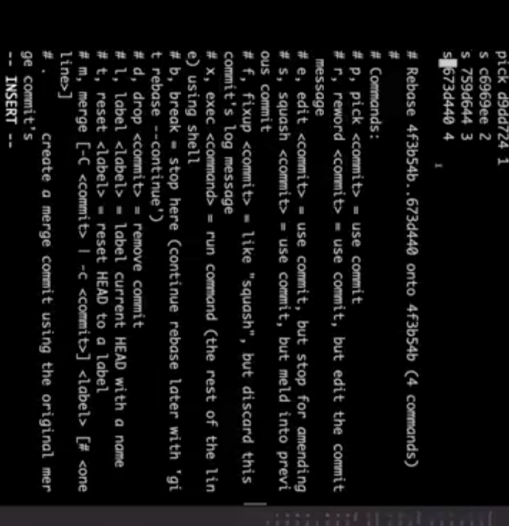

# Git Commands 

```bash 
To check hidden file :
ls -a  


To check what is inside hidden file :
ls .git


To create a file inside a folder :
touch file_name

To check what is written in the file : 
cat file_name


```


<br>
<br>

```bash 
If we want to unstage a file from stagged :
git restore --staged file_name


How we can delete a file or directory from folder :
git rm -rf file_name 

Here 'rm' for remove 

'-r' means Recursive option to remove directories and their contents. If the target is a directory, this flag is necessary.

'f' means Forces the removal of files, even if they are not staged or modified.


If we want to reset our project to a particular commit :
git reset --hard "hash_of_that_particular_commit"


```

<br>
<br>

```bash 
If we make a file and write some code in it and we add it but did not commit it and now I want to clean the code and write some another code But when we need the previous code then we can access it for this :

git stash 
This will clean our directory.

git stash pop 
This will put all the previous code into staged area


If we want to clear that previous code permanently 
git stash clear

This command completely removes all entries from the stash.


To check stash list :
git stash list 

```


# Some Basic Vim (in line terminal) commands :
```bash 

Save and Exit
Press Esc to ensure you are in normal mode.
Type :wq and press Enter.
:w writes (saves) the file.
:q quits Vim.


Save Without Exiting
Press Esc to ensure you are in normal mode.
Type :w and press Enter.

Exit Without Saving
Press Esc to ensure you are in normal mode.
Type :q! and press Enter.
! forces the quit without saving.

Save to a Specific File
Press Esc to enter normal mode.
Type :w filename and press Enter.
This saves the current buffer to the specified filename.

```


<br>
<br>

```bash 
By convention all the files that are attached to personal account repostories in a github url belongs to origin.

git remote -v  
This commands give us all the url that belongs to a folder.
```
# Branch :
A branch in Git is a lightweight, movable pointer to a commit. It is used to isolate work in a version-controlled project, allowing you to develop features, fix bugs, or experiment without affecting the main codebase.

<br>
<br>

<b>Note : 
We should never make commit in main branch while contributing to a open source project because code may have some bugs. In this case we should make a separate branch to add each features to a project.

</b>

# HEAD in Git file : 
Head is just pointing to the last commit made to a current branch.

# Upstream :
It refers to the repository or branch from which your local repository or branch is pulling changes.

```bash 
git push -u origin my-branch


Here -u sets the my-branch branch to track origin/my-branch.
```

# Upstream Url : 
Url from where we have forked a project to our own account is called Upstream url.

# How to Work on open source project :
```bash 

1. Make a fork of that project to your account .

2. clone the project to your system folder.

3. Make changes there and add it and then commit it 

4. git remote add upstream "https://github.com/RupeshKumar4511/Git_Github.git" 

Here it can be any url.

5. git push origin main

6. make a pull request to main branch of open source project.

```


# Pull Request :
A pull request (PR) is a feature in version control systems like Git, used primarily in collaborative development workflows. It allows developers to propose changes to a codebase and request that these changes be reviewed and merged into a target branch (usually the main or development branch).

<br>
<br>

<b>
    Note : One branch is associated with only one pull request so while working on fork of open source project makes separate branch for each features or debugs the bugs and create pull request to main branch of open source project to merge it . Then they sees your code and run some test and give you some suggestion and you may need to made some changes in your code and finally they merge it if your feaature is useful. 
</b>

# Important Point :
If your local repository does not contains the commit which are on online repository and you want to push some changes to online repo.
then it does not work . Then in this case you need to push it forcefully .
```bash 
git push origin main -f 

Here f means forcefully

```

<br>
<br>

While working on fork of open source project when your pull request is merged to main branch of upstream(original open source project repo url) but you did not find that changes in your main branch then 
there are two ways to fetch those changes :
<br>
Ist Way : By clicking  on the Fetch Upstream button on the github repos.
<br>
<br>
IInd way : 
```bash 
1. First go to your main branch :
git checkout main 

2. fetch all the commits and changes :
git fetch --all --prune

Here prune means once which are delted will also fetched.

3. git reset --hard upstream origin/main

This action will:
Point your branch's HEAD to the same commit as upstream/main.
Replace your working directory and index with the upstream branch's state.

or 

we can also pull request of upstream main . 
git pull upstream main 


4. push your changes to main branch.
git push origin main 

```

# Squash Commits : 
It means merging multiple commits in single commits.

<br>
<b>How to pick and squash commits :</b>
<br>
```bash 
1. copy the hash of last commit above which you want merge the commits . 

2. git rebase -i  "hash of last commit"
Here i means interactive environment.


<br>
All the commits below "pick d9dd724 1"
will be squashed to "pick d9dd724"

3. Exit out of it.
Enter Esc and then type ":x" and press enter.
This will allow you to create a message for new commit.


4. Add message and exit using step3.


```


 


